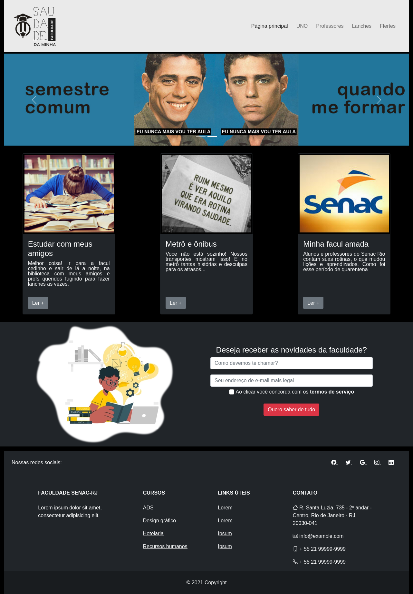
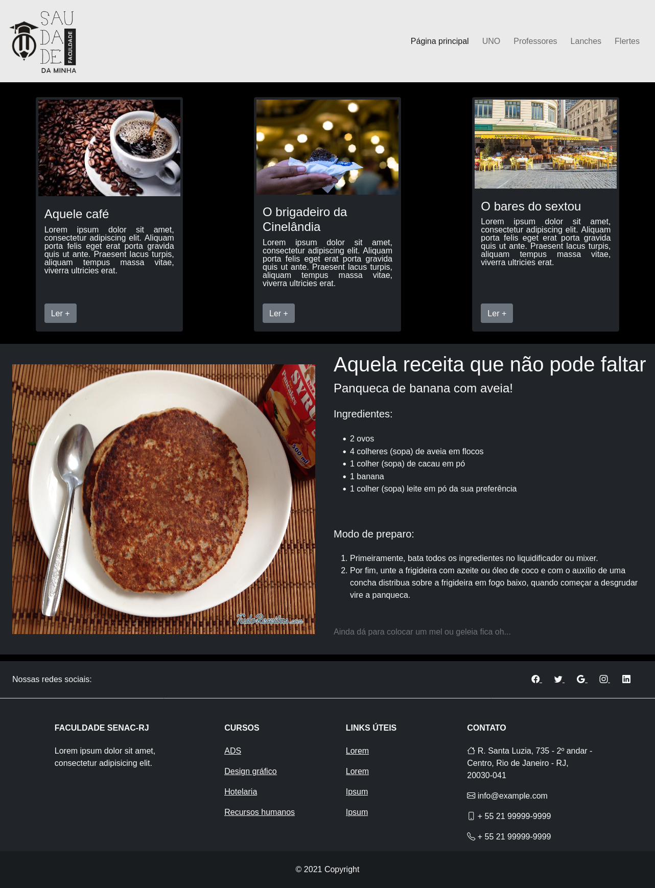
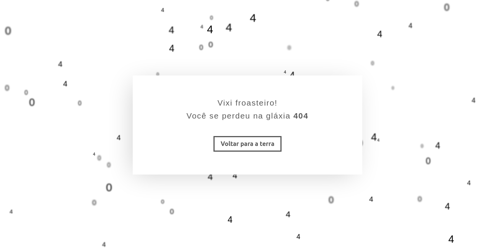

# Saudades da minha faculdade

### Motivação

No período de pandemia e ensino remoto que vivemos, bate aquela saudade das atividades presenciais de ensino. Sendo assim, durante o primeiro período do curso de análise e desenvolvimento de sistemas, foi proposto como trabalho final que criássemos um site estático simples, porém responsivo, utilizando HTML5, CSS3 e Bootstrap com a temática "saudades da minha faculdade". 

O site deveria conter pelo menos duas páginas o index (página principal) e uma outra a nossa escolha que deveria estar linkada no navbar. Dessa forma, optei por realizar a página lanches.

### Tecnologias utilizadas

- HTML5
- CSS3
- Bootstrap
- Bootstrap icons

### Páginas desenvolvidas

#### Index

- Navbar customizado
- Carrosel com duas imagens
- Primeira section com três cards, sendo cada um contendo imagem, titulo, texto e um botão de leia mais
- Segunda section contendo uma imagem e um formulário simples
- Footer completo contemplando links para redes sociais e demais caminhos para o site, além de informações sobre a faculdade

#### Lanches

- Navbar customizado
- Primeira section com três cards, sendo cada um contendo imagem, titulo, texto e um botão de leia mais
- Segunda section contando uma imagem e texto de uma receita
- Footer completo contemplando links para redes sociais e demais caminhos para o site, além de informações sobre a faculdade

### Indo além

Como não sou curioso e o site teria o inconveniente de quando clicasse em uma págia que não foi desenvolvida, resolvi colocar uma página de `404`.

